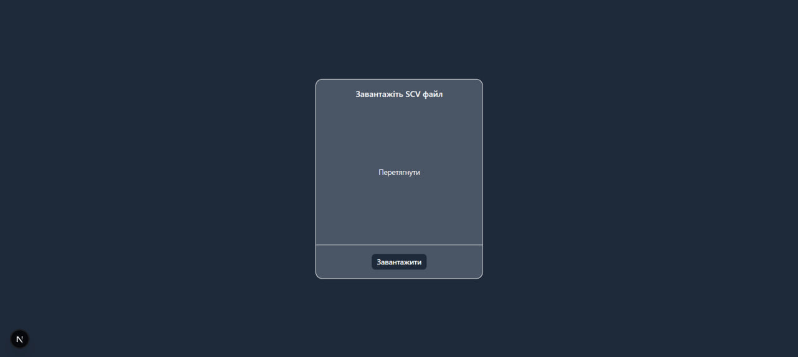

## Як запустити проєкт

```bash
npm install
npm run dev
```
Щоб побачити результат, відкрийте [http://localhost:3000](http://localhost:3000) у вашому браузері.

## Короткий опис рішення
Проєкт приймає CSV файл, парсить дані, розділяє валідні й невалідні рядки. Дані обчислюються, групуються й відображаються у вигляді карток.

Неочевидним моментом для мене було прийти до одного рішення, тому я кілька разів перероблювала логіку збереження та отримання даних. Було обрано sessionStorag, передачу назви файлу в URL і стан через useReducer. Бібліотека zod й papaparse були новими для використування, але час на їхнє освоєння був коротким. Найбільше часу було витрачено на стан керування логікою додатку й рефакторинг. Також особистим рішенням було додати пагінацію, щоб уникнути перевантаження сторінки при великих файлах і покращення читабельності даних. 

## Скріншот головної ("/") сторінки



